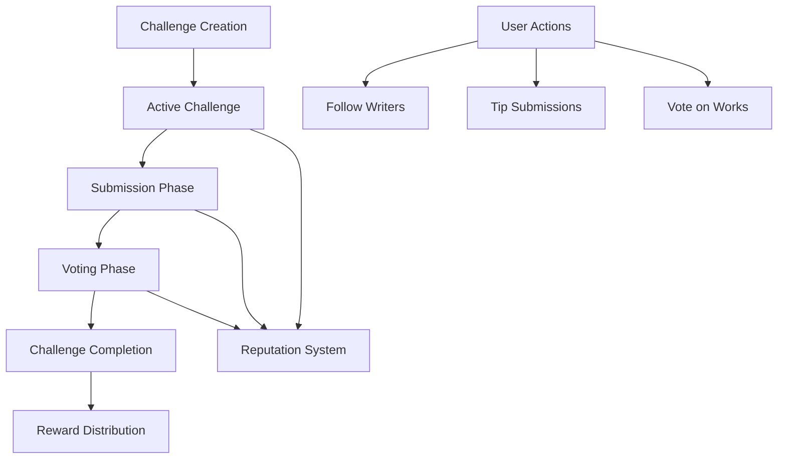

# BrightWave Creative Writing Platform

A decentralized platform fostering creative writing through community-driven challenges and rewards. Writers can submit works to themed challenges, receive feedback, and earn rewards based on community voting and engagement.

## Overview

BrightWave creates an incentive-driven ecosystem where:
- Writers can participate in themed writing challenges
- Readers can discover new content and influence outcomes through voting
- Challenge creators earn rewards for crafting engaging prompts
- All participants build reputation in specific genres

The platform leverages blockchain technology to ensure:
- Transparent voting mechanisms
- Fair reward distribution
- Verifiable ownership of submissions
- Immutable attribution of creative works

## Architecture



### Core Components
- Challenge Management System
- Submission Handling
- Voting Mechanism
- Reward Distribution
- Reputation Tracking
- Social Features (Following, Tipping)

## Contract Documentation

### brightwave.clar

The main contract managing the complete lifecycle of creative writing challenges.

#### Key Features:
- Challenge creation and management
- Work submission handling
- Voting system
- Reward distribution
- Reputation tracking
- Social interactions

#### Access Control
- Challenge creators: Can create and finalize challenges
- Writers: Can submit works and claim rewards
- Readers: Can vote and tip submissions
- Platform admin: Can transfer administrative rights

## Getting Started

### Prerequisites
- Clarinet CLI installed
- Stacks wallet for interactions

### Basic Usage

1. Create a Challenge:
```clarity
(contract-call? .brightwave create-challenge 
    "Summer Short Stories" 
    "Write a summer-themed short story" 
    "fiction" 
    u43200 
    u43200 
    u100000 
    u1000000)
```

2. Submit Work:
```clarity
(contract-call? .brightwave submit-work 
    u1 
    "My Summer Tale" 
    0x...)
```

3. Vote for a Submission:
```clarity
(contract-call? .brightwave vote-for-submission u1)
```

## Function Reference

### Public Functions

#### Challenge Management
```clarity
(create-challenge (title (string-ascii 100)) (description (string-utf8 500)) (genre (string-ascii 50)) (duration uint) (voting-duration uint) (submission-fee uint) (stake uint))
(finalize-challenge (challenge-id uint))
```

#### Submission Operations
```clarity
(submit-work (challenge-id uint) (title (string-ascii 100)) (content-hash (buff 32)))
(vote-for-submission (submission-id uint))
(tip-submission (submission-id uint) (amount uint))
```

#### Reward Claims
```clarity
(claim-rewards (submission-id uint))
(claim-creator-rewards (challenge-id uint))
```

#### Social Features
```clarity
(follow-writer (writer principal))
(unfollow-writer (writer principal))
```

## Development

### Testing
1. Clone the repository
2. Install dependencies: `clarinet install`
3. Run tests: `clarinet test`

### Local Development
1. Start Clarinet console: `clarinet console`
2. Deploy contract: `(contract-call? .brightwave ...)` 

## Security Considerations

### Limitations
- Maximum 100 submissions per challenge
- Maximum 100 votes per user per challenge
- Challenge duration limits: 12 hours minimum, 6 months maximum

### Best Practices
- Always verify challenge status before interactions
- Check reward eligibility before claiming
- Avoid self-voting
- Verify transaction success
- Consider gas costs for operations

### Platform Fees
- Challenge creation: 1 STX
- Default submission fee: 0.1 STX
- Platform fee: 5% of rewards
- Reward distribution:
  - First place: 50%
  - Second place: 30%
  - Third place: 15%
  - Challenge creator: 5%